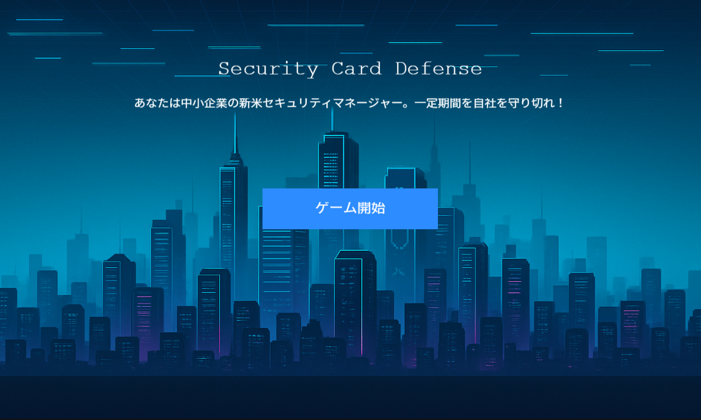

# MWS Cup 2025 Hackathon: Security Card Defense

**Team Name:** Jinkai Senjutsu_ANIMAS

## Overview

`Security Card Defense` is an educational card game for security beginners. Players take on the role of a rookie security administrator in a small to medium-sized enterprise, making decisions to protect the organization from incidents and failures while managing costs and resources. The game aims not only to teach knowledge but also to provide experience in making trade-off decisions required in real-world business scenarios.




## Play the Game

You can play the game directly in your browser from the following link:

[**=> Play MWS Cup 2025 Hackathon: Security Card Defense**](https://mws2025-hstteam4.github.io/Hackathon/)

---

## 1. Background and Issues

### 1.1. Current State of Security in Japan

- **Awareness Survey:** A 2024 survey by NordVPN reported that security awareness among Japanese people is at a low level compared to other surveyed countries.
- **Talent Shortage:** A 2023 survey by ISC2 indicated a shortage of about 110,000 security professionals in Japan, making securing talent a significant challenge.

### 1.2. Learning Challenges for Beginners

Opportunities to engage with IT are increasing, such as "Information I" becoming a mandatory high school subject. However, while knowledge can be gained from books and websites, opportunities to learn the practical decision-making skills required in a business context—considering an organization's actual situation and limitations—are scarce.

This project aims to provide this practical learning opportunity.

---

## 2. Purpose and Concept

The goal is to learn the **process of deciding on security measures** while engaging with concrete examples.

- **Understanding Security Measures:** Learn about specific security elements and their roles through the game.
- **Stimulating Interest:** Aims to spark interest in the security field through the accessible format of a game.
- **Experiencing Trade-offs:** Gain experience in making optimal decisions under constraints of cost, personnel, and time.

---

## 3. Product: Security Card Defense

Players act as security administrators for an SME, protecting the organization by responding to various incidents.

### Key Game Elements

- **Measure Selection:** Select and execute various security measures in the form of cards.
- **Cost Management:** Manage resources such as `Funds`, `Personnel`, and `Time`.
- **Responding to Uncertainty:** Deal with unexpected events and incidents.

### Game Statuses
- **Health:** Represents the organization's credibility. The game is over if it runs out.
- **Funds:** Used to execute measures and purchase cards.
- **Personnel:** Human resources required to execute measures.
- **Budget:** Source of funds replenished at checkpoints.
- **Hidden Statuses:** The player's actions may affect factors like the incident occurrence rate.

### Game Flow
1.  **Select a Map**
2.  **Rest or Execute an Event**
3.  **Purchase Equipment at the Shop**
4.  **Perform Duties**

The goal is to protect the organization by repeating this cycle.

---

## 4. Key Features and Innovations

### 4.1. Representation of Realism
We classified attack and defense elements and assigned them as attributes to cards. This clarifies "what kind of defense it is" and "where it attacks," bringing the game closer to real-world scenarios.

### 4.2. Plug and Play
We eliminated the need for any special environment setup, allowing the game to be played simply by opening an HTML file in a browser. To avoid CORS policy violations in a local environment, all resources—JavaScript, CSS, and images (in Base64 format)—are bundled into a single HTML file.

*Note: The game has only been tested on `Google Chrome`.*

---

## 5. Future Roadmap

| Item | Current Status | Improvement Plan |
| :--- | :--- | :--- |
| **Technology Card Specs** | The same card can be deployed multiple times. | Once a technology is deployed, it transitions to a "maintenance" phase. |
| **Attack Response** | Attacks are not visible, and responses are passive. | Visualize attacks through logs, etc., to enable proactive defense actions based on the situation. |
| **Learning Support** | Players can learn defense categories but not details. | Add a play-assist AI to provide deeper knowledge. |

---

## 6. Expected Effects

- **Learning Security Elements:** Provides an opportunity to naturally encounter security knowledge while enjoying the game.
- **Learning Cost Management:** Serves as practice for managing limited resources and making investment decisions.
- **Increased Motivation to Learn:** We expect the game format to help maintain learning motivation.

---

## 7. For Developers

### 7.1. Tech Stack
- **Game Engine:** [Phaser 3](https://phaser.io/)
- **Language:** JavaScript (ES6+)
- **Architecture:** All logic and assets are bundled into a single HTML file. The only external library dependency is Phaser.

### 7.2. Running Locally
A local server is required to run and debug the development version (`src/sStS6.html`) to avoid CORS policy issues. If you have Python installed, you can start a simple server with the following commands:

```bash
# 1. Navigate to the repository's root directory
cd /path/to/Hackathon

# 2. Navigate to the src directory
cd src

# 3. Start the server using Python's http.server module
python -m http.server 8000
```

Then, open `http://localhost:8000/sStS6.html` in your browser.

### 7.3. Contributing
Contributions such as feature additions and bug fixes are welcome. Please create an Issue or send a Pull Request for any improvement proposals.
