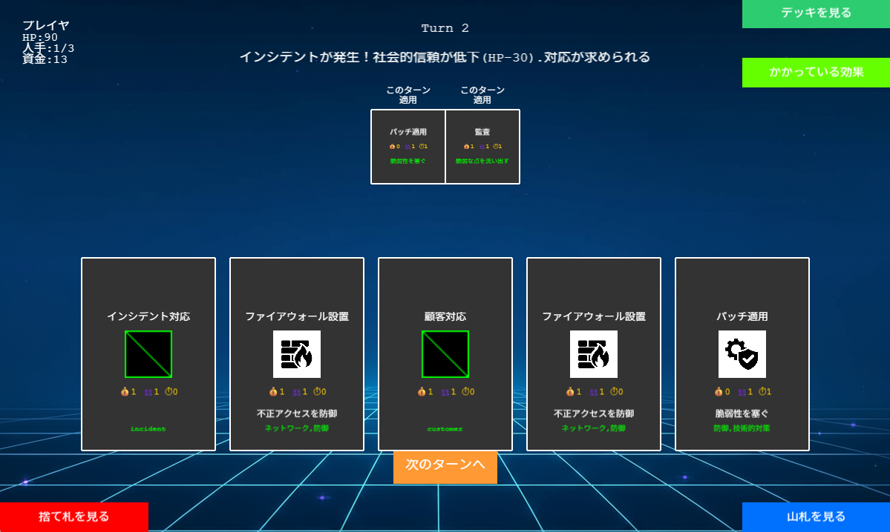
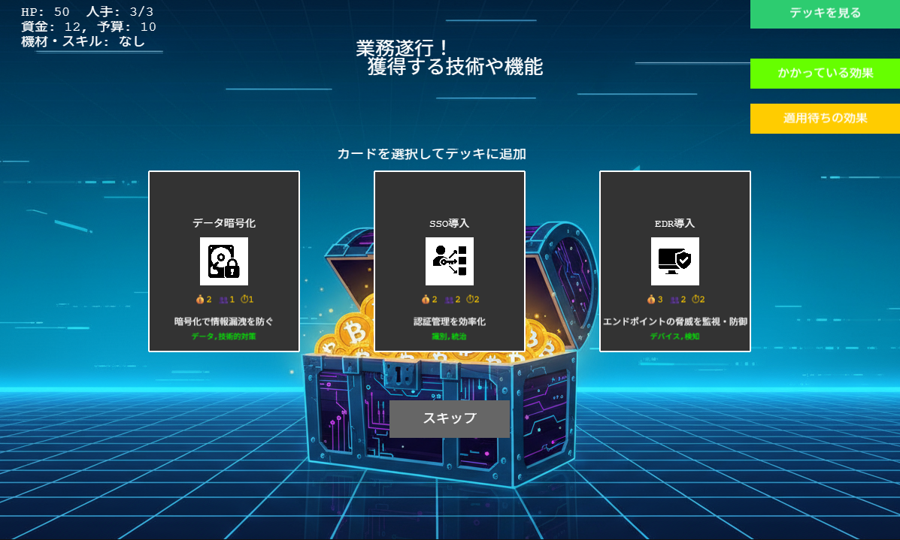

# MWS Cup 2025 Hackathon: Security Card Defense

**チーム名:** 人海戦術_ANIMAS

## 概要

`Security Card Defense`は、セキュリティ初学者を対象とした学習用のカードゲームです。プレイヤーは中小企業の新米セキュリティ管理者となり、インシデントや障害から組織を守るために、コストやリソースを管理しながら対応を決定していきます。本ゲームは、知識の学習だけでなく、現実の業務で求められるトレードオフを考慮した意思決定の経験を積むことを目的としています。





## ゲームをプレイ

以下のリンクからブラウザで直接ゲームをプレイできます。

[**=> MWS Cup 2025 Hackathon: Security Card Defense をプレイ**](https://mws2025-hstteam4.github.io/Hackathon/)

---

## 1. 背景と課題

### 1.1. 日本のセキュリティに関する現状

- **意識調査:** 2024年のNordVPNの調査では、日本人のセキュリティに関する意識は調査対象国の中で低い水準にあると報告されています。
- **人材不足:** 2023年のISC2による調査では、国内で約11万人の専門家が不足していると指摘されており、セキュリティ人材の確保が課題となっています。

### 1.2. 初学者の学習における課題

近年、高等学校で「情報I」が必修化されるなど、ITに触れる機会は増えています。しかし、書籍やWebサイトで知識は得られるものの、実務で要求される「組織の実態や制限を踏まえた意思決定」を学ぶ機会は限られています。

本プロジェクトは、この実践的な学習機会を提供することを目的としています。

---

## 2. 目的とコンセプト

セキュリティ対策の具体例に触れながら、**対策を決定するプロセス**を学習することを目的としています。

- **セキュリティ対策の理解:** ゲームを通じて、具体的なセキュリティ要素とその役割を学びます。
- **関心の喚起:** ゲームという親しみやすい形で、セキュリティ分野への興味を引き出すことを目指します。
- **トレードオフの体験:** コスト、人材、時間といった制約の中で、最適な判断を下す経験を積みます。

---

## 3. 成果物: Security Card Defense

プレイヤーは中小企業のセキュリティ管理者となり、様々なインシデントに対応しながら組織を守ります。

### ゲームの主な要素

- **施策の選択:** 様々なセキュリティ施策をカードとして選択し、実行します。
- **コスト管理:** `資金` `人手` `時間` といったリソースを管理します。
- **不確実性への対応:** 予期せぬイベントやインシデントに対応します。

### ゲームのステータス
- **体力:** 組織の信頼性を表す値。尽きるとゲームオーバー。
- **資金:** 施策の実行やカードの購入に使用します。
- **人手:** 施策の実行に必要な人的リソース。
- **予算:** チェックポイントごとに補充される資金源。
- **隠しステータス:** プレイヤーの行動が、インシデントの発生率などに影響を与える場合があります。

### ゲームの流れ
1.  **マップを選択**
2.  **休憩やイベントを実行**
3.  **ショップで機材を購入**
4.  **業務を遂行**

このサイクルを繰り返し、組織を守り抜くことを目指します。

---

## 4. 工夫した点

### 4.1. 現実性の表現
攻撃と防御の要素を分類し、カードに属性として付与することで、「何の防御力か」「どこを攻撃するのか」を明確化し、現実の状況に近づける工夫をしました。

### 4.2. Plug and Play
特別な環境構築を不要にし、ブラウザでHTMLファイルを開くだけでプレイできるようにしました。
ローカル環境でのCORSポリシー違反を避けるため、JavaScript、CSS、画像（Base64形式）など、すべてを単一のHTMLファイルにまとめています。

*※ `Google Chrome`でのみ動作確認済みです。*

---

## 5. 今後の展望

| 項目 | 現状 | 改善案 |
| :--- | :--- | :--- |
| **技術カードの仕様** | 同じカードを何度でも設置できる | 一度設置した技術は「保守管理」のフェーズに移行させる |
| **攻撃への対処** | 攻撃が可視化されておらず、対処が受動的 | ログなどで攻撃を可視化し、状況に応じた防御行動を可能にする |
| **学習支援** | 防御手法の分類は学べるが、詳細な知識は得にくい | プレイアシストAIを追加し、より深い知識を学べるようにする |

---

## 6. 期待できる効果

- **セキュリティ要素の学習:** ゲームを楽しみながら、自然とセキュリティの知識に触れる機会を提供します。
- **コスト管理の学習:** 限られたリソースを管理し、投資判断を行う練習になります。
- **学習意欲の向上:** ゲーム形式にすることで、学習のモチベーション維持に繋がることを期待しています。

---

## 7. 開発者向け情報

### 7.1. 技術スタック
- **Game Engine:** [Phaser 3](https://phaser.io/)
- **Language:** JavaScript (ES6+)
- **Architecture:** 全てのロジック、アセットを単一のHTMLファイルにバンドルしています。外部ライブラリへの依存はPhaserのみです。

### 7.2. ローカルでの実行方法
開発版（`src/sStS6.html`）をローカルで実行・デバッグする際は、CORSポリシーを回避するためローカルサーバーが必要です。Pythonがインストールされている環境では、以下のコマンドで簡易的にサーバーを起動できます。

```bash
# 1. リポジトリのルートディレクトリに移動
cd /path/to/Hackathon

# 2. srcディレクトリに移動
cd src

# 3. Pythonのhttp.serverモジュールを使ってサーバーを起動
python -m http.server 8000
```

その後、ブラウザで `http://localhost:8000/sStS6.html` にアクセスしてください。

### 7.3. コントリビューション
機能追加やバグ修正などのコントリビューションを歓迎します。改善提案はIssueを立てるか、Pull Requestを送ってください。


